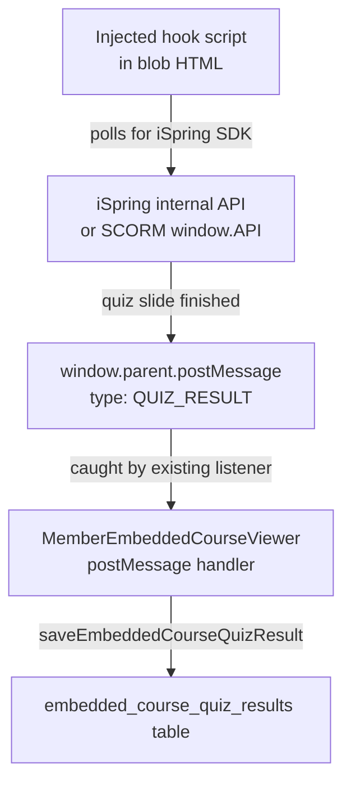

# iSpring Quiz Slide Capture

## How it works




The existing `postMessage` listener and `saveEmbeddedCourseQuizResult` service are already in place. Only the **injected script** needs to be added.

---

## Only one file changes

**Edit:** `[src/pages/member/MemberEmbeddedCourseViewer.tsx](src/pages/member/MemberEmbeddedCourseViewer.tsx)`

---

## What to inject

A self-contained IIFE injected into `<head>` alongside the existing `enrollmentScript`, using the same pattern already in the file (line ~138):

```ts
html = html.replace(/<\s*head(\s[^>]*)?>/i, (m) => m + quizHookScript);
```

The script tries **three strategies** in priority order, covering different iSpring versions and publish modes:

### Strategy 1 — SCORM 1.2 `window.API` hook (most reliable)

iSpring courses published with SCORM tracking expose `window.API`. We wrap `SetValue` to intercept when iSpring writes the score:

```js
(function () {
  function send(slide, score, maxScore, passed) {
    window.parent.postMessage(
      { type: 'QUIZ_RESULT', slide: slide, score: score, maxScore: maxScore, passed: passed },
      '*'
    );
  }

  // Strategy 1: SCORM 1.2 API
  function hookScorm(api) {
    if (api.__quizHooked) return;
    api.__quizHooked = true;
    var orig = api.SetValue.bind(api);
    api.SetValue = function (key, val) {
      if (key === 'cmi.core.score.raw') {
        var title = document.title || 'Quiz';
        var max = parseFloat(api.GetValue('cmi.core.score.max')) || 100;
        var raw = parseFloat(val) || 0;
        var status = api.GetValue('cmi.core.lesson_status');
        send(title, raw, max, status === 'passed' || status === 'completed');
      }
      return orig(key, val);
    };
  }

  // Strategy 2: iSpring SDK (newer HTML5 output)
  function hookSdk(sdk) {
    if (sdk.__quizHooked) return;
    sdk.__quizHooked = true;
    if (sdk.on) {
      sdk.on('quizAttemptFinished', function (e) {
        send(e.quizName || document.title, e.score, e.maxScore, e.passed);
      });
    }
  }

  // Poll until one of the APIs appears (max 60s)
  var attempts = 0;
  var poll = setInterval(function () {
    attempts++;
    if (attempts > 120) { clearInterval(poll); return; }
    if (window.API && window.API.SetValue) {
      clearInterval(poll);
      hookScorm(window.API);
    } else if (window.sdk && window.sdk.on) {
      clearInterval(poll);
      hookSdk(window.sdk);
    }
  }, 500);
})();
```

---

## Where it goes in the viewer

The injection is added right after the existing `enrollmentScript` injection (around line 138 of `MemberEmbeddedCourseViewer.tsx`):

```ts
// existing
html = html.replace(/<\s*head(\s[^>]*)?>/i, (m) => m + enrollmentScript);
// new
html = html.replace(/<\s*head(\s[^>]*)?>/i, (m) => m + quizHookScript);
```

`quizHookScript` is a constant defined just above containing the IIFE wrapped in `<script>` tags.

---

## Result

- As soon as a member completes a quiz slide (iSpring fires the score event), a row is written to `embedded_course_quiz_results` — no button click needed.
- The results panel below the iframe still reads from the DB and displays after "Mark as complete" is clicked.
- No changes needed to the migration, types, or service layer — they are already correct.

